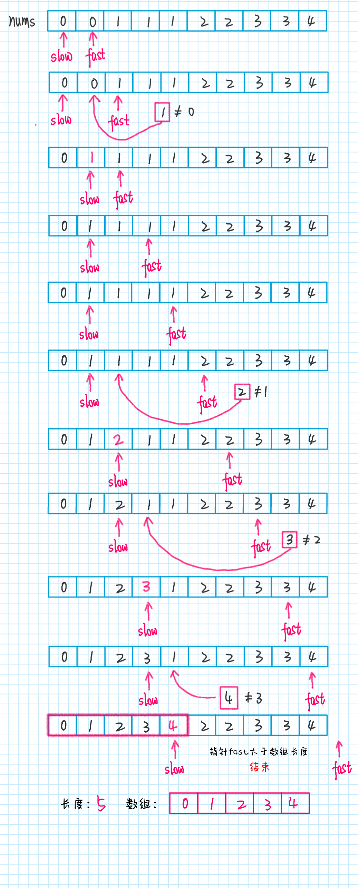

# 删除有序数组中的重复项

给你一个有序数组 `nums` ，请你**原地**删除重复出现的元素，使每个元素 只出现一次 ，返回删除后数组的新长度。

不要使用额外的数组空间，你必须在**原地**修改输入数组 并在使用 O(1) 额外空间的条件下完成。

 

说明:

为什么返回数值是整数，但输出的答案是数组呢?

请注意，输入数组是以「引用」方式传递的，这意味着在函数里修改输入数组对于调用者是可见的。

你可以想象内部操作如下:
```ts
// nums 是以“引用”方式传递的。也就是说，不对实参做任何拷贝
int len = removeDuplicates(nums);

// 在函数里修改输入数组对于调用者是可见的。
// 根据你的函数返回的长度, 它会打印出数组中 该长度范围内 的所有元素。
for (int i = 0; i < len; i++) {
    print(nums[i]);
}
 
```
示例 1：
```
输入：nums = [1,1,2]

输出：2, nums = [1,2]

解释：函数应该返回新的长度 2 ，并且原数组 nums 的前两个元素被修改为 1, 2 。不需要考虑数组中超出新长度后面的元素。
```
示例 2：
```
输入：nums = [0,0,1,1,1,2,2,3,3,4]

输出：5, nums = [0,1,2,3,4]

解释：函数应该返回新的长度 5 ， 并且原数组 nums 的前五个元素被修改为 0, 1, 2, 3, 4 。不需要考虑数组中超出新长度后面的元素。
```

## 提示：

> 0 <= nums.length <= 3 * 104
> 
> -104 <= nums[i] <= 104
>
> nums 已按升序排列

## 关键

* 数组已经排序，所以重复的元素一定连在一起，找出它们并不难，但如果毎找到一个重复元素就立即删除它，就是在数组中间进行删除操作，整个时间复杂度是会达到 O(N^2)
* 题目要求原地删除，原地删除的意思通俗一点的说就是不占用额外的空间
* 通用解法就是使用快慢指针技巧
* 让慢指针slow走在后面，快指针fast走在前面探路，找到一个不重复的元素就告诉slow并让slow前进一步，这样当fast指针遍历完整个数组nums后，nums[0..slow]就是不重复元素。


## 直接遍历并修改数组下标
```ts
function removeDuplicates(nums: number[]): number {
  for (let index = 1; index < nums.length; index++) {
    if (nums[index] === nums[index - 1]) {
      nums.splice(index, 1)
      index = index - 1
    }
  }
  return nums.length
};
```

## 双指针修改数组元素
```ts
export const removeDuplicates = (list: number[]): number => {
  let i: number = 0

  for (let j = 1; j < list.length; j++) {
    if (list[j] !== list[i]) {
      i++
      list[i] = list[j]
    }
  }
  return i + 1
}
```

