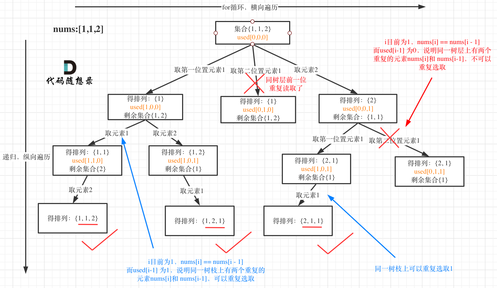

# 46.全排列

给定一个不含重复数字的数组 `nums` ，返回其 所有可能的全排列 。你可以 按任意顺序 返回答案。


## 示例

```
输入：nums = [1,2,3]
输出：[[1,2,3],[1,3,2],[2,1,3],[2,3,1],[3,1,2],[3,2,1]]

```
```
输入：nums = [0,1]
输出：[[0,1],[1,0]]
```

```
输入：nums = [1]
输出：[[1]]
```

## 思路


排列问题和组合问题不一样, 排列是有序的.所以`[1,3]`和`[2,3]`是两个不同的排列. 
如果穿换成树形图来理解, 可以发现我们现在需要的是同一个元素在一棵选择树中子出现一次(与树层去重相对应). 这里还是可以用`used`数组来判断是否曾经出现过. 

```typescript 
export function permutations(nums: number[]): number[][] {
  const results: number[][] = []
  const used: boolean[] = new Array(nums.length).fill(false)

  if(!nums.length) return results

  function backTracking(path: number[]) {
    if(path.length === nums.length) return results.push([...path])

    for(let i = 0 ; i < nums.length ; i ++) {
      if(used[i] === true) continue

      path.push(nums[i])
      used[i] = true

      backTracking(path)

      path.pop()
      used[i] = false
    }
    
  }

  backTracking([])

  return results
}
```

---

# 全排列II
给定一个可包含重复数字的序列 nums ，按任意顺序 返回所有不重复的全排列。

## 示例：

```
输入：nums = [1,1,2]
输出： [[1,1,2], [1,2,1], [2,1,1]]
```
``` 
输入：nums = [1,2,3]
输出：[[1,2,3],[1,3,2],[2,1,3],[2,3,1],[3,1,2],[3,2,1]]
```

## 思路 
这道题目和全排列I 的区别在与给定一个可包含重复数字的序列，要返回所有不重复的全排列。


* 需要对同一个树层进行去重
* 因为全排列的每一个循环都从0开始, 有可能出现第一个元素就重复的情况, 所以还需要增加这个去重 

```typescript 
export function permutationsII(nums: number[]): number[][] {
  const results: number[][] = []
  if(!nums.length) return results
  const path: number[] = []
  const used: boolean[] = new Array(nums.length).fill(false)

  nums.sort((a,b) => a - b)

  function backTrack() {
    if(path.length >= nums.length) return results.push([...path])

    for(let i = 0 ; i < nums.length; i++) {
      if(i > 0 && nums[i] === nums[i - 1] && !used[i - 1]) continue 

      if(!used[i]) {
        path.push(nums[i])
        used[i] = true 

        backTrack()

        path.pop()
        used[i] = false
      }
    }
  }

  backTrack()

  return results
}
```

