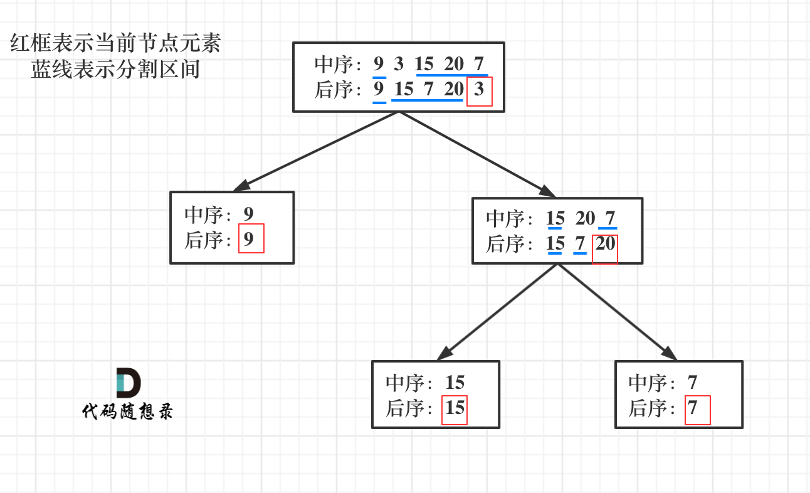

# 从后序和中序遍历序列构造二叉树 


根据一棵树的中序遍历与后序遍历构造二叉树。

注意: 你可以假设树中没有重复的元素。

## 示例 
```
例如，给出

中序遍历 inorder = [9,3,15,20,7] 后序遍历 postorder = [9,15,7,20,3] 返回如下的二叉树：
     3 
    / \
   9   20
      /  \
     15   7
```

## 思路

首先回忆一下如何根据两个顺序构造一个唯一的二叉树，相信理论知识大家应该都清楚，**就是以`后序数组`的最后一个元素为切割点，先切中序数组，根据中序数组，反过来在切后序数组。**一层一层切下去，每次后序数组最后一个元素就是节点元素。

如果让我们肉眼看两个序列，画一棵二叉树的话，应该分分钟都可以画出来。



第一步：如果数组大小为零的话，说明是空节点了。

第二步：如果不为空，那么取后序数组最后一个元素作为节点元素。

第三步：找到后序数组最后一个元素在中序数组的位置，作为切割点

第四步：切割中序数组，切成中序左数组和中序右数组 （顺序别搞反了，一定是先切中序数组）

第五步：切割后序数组，切成后序左数组和后序右数组

第六步：递归处理左区间和右区间

### 递归法
1. 递归需要的参数: `inorder`和`postorder`数组, 因为第一个已知条件是后序数组的最后一位`postEnd`, 以及用来被切割的中序数组的`inStart`,`inEnd`
2. 递归终止的条件: `if(inStart > inEnd || postEnd < 0) return null` 
3. 单层需要操作的逻辑: 
   ```typescript
   // 在后序数组中找到root
   const root = postorder[postEnd]

   // 找到root的元素在中序数组中所对应的位置 rootIndex
   let rootIndex: number = 0 
   for(let i = inStart; i <= inEnd ; i++) {
     if(root.val === inorder[i]) rootIndex = i 
   }
   // 借助rootIndex来递归搜索root的左子树和右子树并插入到root中
   root.left = helper(inorder, postorder, postEnd - (inEnd-rootIndex) - 1, inStart, rootIndex - 1) 
   root.right = helper(inroder, postorder, postEnd - 1, rootIndex + 1, inEnd)

   // 返回root节点
   return root
   ```
```typescript

export function buildTree(inorder: number[], postorder: number[]): TreeNode | null {
  if(!inorder.length) return null
  return helper(inorder, postorder, 0, inorder.length - 1, postorder.length -1)    
};

function helper(inorder: number[], postorder: number[], inStart: number, inEnd: number, postEnd: number): TreeNode | null {
  if(inStart > inEnd || postEnd < 0) return null

  let root = new TreeNode(postorder[postEnd])
  let inIndex: number = 0 

  for(let i = inStart; i <= inEnd ; i++) {
    if(inorder[i] === root.val) {
        inIndex = i
    }
  }

  root.left = helper(inorder, postorder, inStart, inIndex-1, postEnd-(inEnd - inIndex)-1)
  root.right = helper(inorder, postorder, inIndex + 1, inEnd, postEnd-1)

  return root
}
```


# 从前序和中序遍历序列构造二叉树

Given preorder and inorder traversal of a tree, contruct the binary tree. You may assume the duplicates do not exist in the tree.

## 示例
```
Input:

preorder: [3, 9, 20, 15, 7]
inorder: [9,3,15,20,7]

Output: 

   3 
  / \
 9   20
    /  \
   15   7
```

## 思路 

1. The root node is `preorder[0]`.
2. find the element in the `inorder`.
3. know the elements in the left tree, know the elements in the right tree.
4. recursively go into the left tree and right tree. 

和105题类似, 也是通过前序数组的第一个元素为root为切入点开始递归
```typescript 
function buildTree(preorder: number[], inorder: number[]): TreeNode | null {
  if(!preorder.length) return null
  return helper(preorder, inorder, 0, 0, inorder.length - 1)
};

function helper(preorder: number[], inorder: number[], preStart: number, inStart: number, inEnd: number) {
  if(preStart > preorder.length || inStart > inEnd) {
    return null 
  }

  const root = new TreeNode(preorder[preStart])
  
  let rootIdx = 0 
  for(let i = inStart; i <= inEnd; i++) {
    if(root.val === inorder[i]) rootIdx = i
  }

  root.left = helper(preorder, inorder, preStart + 1, inStart, rootIdx - 1) 
  root.right = helper(preorder, inorder, preStart + (rootIdx - inStart) + 1, rootIdx + 1, inEnd)

  return root
}
```
 

