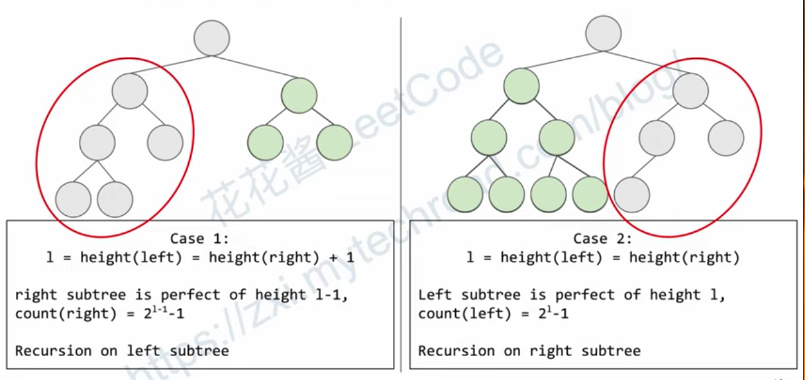

# 完全二叉树的节点个数 

给你一棵 完全二叉树 的根节点 root ，求出该树的节点个数。

> 在完全二叉树中，除了最底层节点可能没填满外，其余每层节点数都达到最大值，并且最下面一层的节点都集中在该层最左边的若干位置。若最底层为第 h 层，则该层包含 1~ 2h 个节点。

## 思路 

本题可以从 普通二叉树 和 完全二叉树 这两个角度出发. 

对于普通二叉树来说, 可以用递归法, 层序遍历, 迭代法 计算 

### 普通二叉树递归法 
1. 确定参数: `countNode(node: TreeNode | null)`
2. 递归终止条件: `if(!node) return 0`
3. 确定单层逻辑 
* `left = countNode(node.left)`
* `right = countNode(node.right)`
* `return left + right + 1`

```typescript
export function countNodes(root: TreeNode){
  return countNode(root)
}


export function countNode(node: TreeNode | null) {
  if(!node) return 0

  let left = countNode(node.left)
  let right = countNode(node.right)

  return left + right + 1
}
```

### 层序遍历 
```typescript
export function countNodes(root: TreeNode){
  let count: number = 0
  if(!root) return count

  const queue: TreeNode[] = []
  let curr: TreeNode | null = root
  let lvlen: number = 0 

  queue.push(curr)

  while(queue.length > 0) {
    lvlen = queue.length

    for(let i = 0 ; i < lvlen; i++) {
      count++
      curr = queue.shift()!
      curr?.left && queue.push(curr.left)
      curr?.right && queue.push(curr.right)
    }
  }

  return count
}
```

### 迭代(后序遍历)

```typescript
export function countNodes(root: TreeNode){
  let count: number = 0
  if(!root) return count

  const stack: TreeNode[] = []
  let curr: TreeNode | null = root;

  stack.push(curr)
  count++

  while(stack.length > 0) {
    curr = stack.pop()! 

    if(curr?.right) {
      stack.push(curr.right)
      count++
    }

    if(curr?.left) {
      stack.push(curr.left)
      count++
    }
  }

  return count
}
```


### 利用完全二叉树的性质


可使用递归法, 如果某个节点不是二叉树, 那么就分别计算左右两个二叉树的节点数量 

> 对于一个满二叉树(complete binary tree)来说, 其叶子节点是完全二叉树(perfect binary tree)
> 对于一个满二叉树(N个节点)来说, 它的最大高度就是其左子树的高度, 时间复杂度为`O(log N)`

1. 确定参数: `countNodes(root: TreeNode | null)`
2. 确定递归终止条件: 
    * `if(!root) return 0`
    * 如果是满二叉树, 深度为depth的话, 节点的数量为`Math.pow(2, depth) - 1`
    * 如果不是满二叉树, 一定需要递归左子树(或者右子树), 返回两边的和
    

3. 确定单层逻辑
    * 计算左右子树的高度, 
    * **如果左右子树同高, 那么这棵树就是完美二叉树**
    * 如果左右子树不同高, 那么必有一个是完美二叉树, 另一个是满二叉树 

```typescript
export function countNodes(root: TreeNode){
  if(!root) return 0

  let leftNode: TreeNode | null = root.left 
  let leftDep: number = 0

  let rightNode: TreeNode | null = root.right 
  let rightDep: number = 0 

  // 计算左子树的高度
  while(leftNode) {
    leftNode = leftNode.left
    leftDep++
  } 

  // 计算右子树的高度
  while(rightNode) {
    rightNode = rightNode.right
    rightDep++
  }

  // 如果是完全二叉树
  if(leftDep === rightDep) return Math.pow(2, leftDep + 1) - 1 

  // 如果有一棵是完全二叉树, 另一棵不是完全二叉树, 需要递归
  // 不是完全二叉树的那棵树还可以再次被分成完全二叉树和非完全二叉树
  return countNodes(root.left) + countNodes(root.right) + 1
}
```


