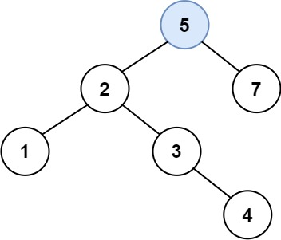

# 二叉搜索树中的插入操作

给定二叉搜索树（BST）的根节点 root 和要插入树中的值 value ，将值插入二叉搜索树。 返回插入后二叉搜索树的根节点。 输入数据 保证 ，新值和原始二叉搜索树中的任意节点值都不同。

注意，可能存在多种有效的插入方式，只要树在插入后仍保持为二叉搜索树即可。 你可以返回 任意有效的结果 。

## 示例 

```
输入: root = [4,2,7,1,3], val = 5 
输出: 
* [4,2,7,1,3]
* 或者[5,2,7,1,3,null,null,null,null,null,4]
```




## 思路 

遇到空节点插入即可

1. 递归需要的参数: `node: TreeNode | null, val: number`; 返回: `TreeNode | null`
2. 递归终止的条件: `if(!node) return new TreeNode(val)`
3. 单层递归需要处理的逻辑:
  ```typescript 
  export function insertBST(root: TreeNode | null, val: number): TreeNode {
    if(!root) return new TreeNode(val)

    if(root.val > val) { 
      root.left = insertBST(root.left, val)
    }

    else if(root.val < val) {
      root.right = insertBST(root.right, val)
    }

    return root
  }
  ```

