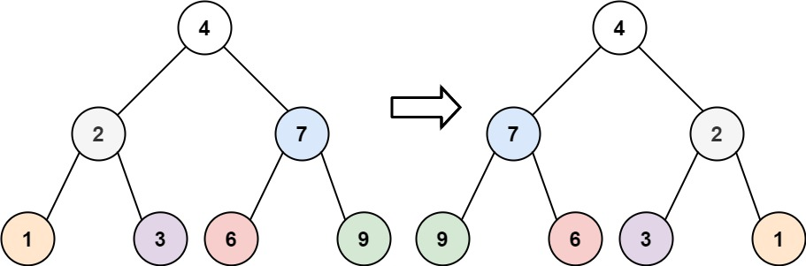

# 翻转二叉树

给你一棵二叉树的根节点 root ，翻转这棵二叉树，并返回其根节点。

## 示例 



```
输入：root = [4,2,7,1,3,6,9]
输出：[4,7,2,9,6,3,1]
```


```
输入：root = [2,1,3]
输出：[2,3,1]
```

### 思路: 前序遍历

对于每一个节点来说, 只需要对调左右两个子节点, 便可以最终达翻转整个二叉树的目的

```typescript 
export function invertTree(root: TreeNode) {
  const stack: TreeNode[] = []
  let curr: TreeNode = root 
  let tmp: TreeNode

  stack.push(curr)

  while(stack.length > 0) {
    curr = stack.pop()!
    
    tmp = curr?.left
    curr.left = curr?.right
    curr.right = tmp

    curr?.right && stack.push(curr.right)
    curr?.left && stack.push(curr.left)
  }
  
  return root
}
```

### 思路: 统一迭代法(后序)
```
export function invertTree(root: TreeNode) {
  const stack: TreeNode[] = []
  let curr: TreeNode = root 
  let tmp: TreeNode

  stack.push(curr)

  while(stack.length > 0) {
    curr = stack.pop()!

    if(curr) {
      stack.push(curr)
      stack.push(null)
      curr?.right && stack.push(curr.right)
      curr?.left && stack.push(curr.left)
    } else {
      curr = stack.pop();

      tmp = curr?.left
      curr.left = curr?.right
      curr.right = tmp
    }

  }
  return root
}

### 思路: 层序遍历

```typescript
export function invertTree(root: TreeNode) {
  const queue: TreeNode[] = []
  let curr: TreeNode = root 
  let tmp: TreeNode
  let lvlen: number 
  
  queue.push(curr)

  while(queue.length > 0) {
    lvlen = queue.length 

    for(let i = 0; i < lvlen; i++) {
      curr = queue.shift()!

      tmp = curr?.left
      curr.left = curr?.right
      curr.right = tmp

      curr?.left && queue.push(curr.left)
      curr?.right && queue.push(curr.right)
    }

  }
  
  return root
}
```
