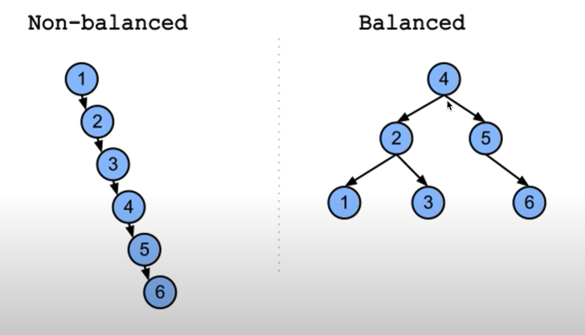

# 平衡二叉树 

> 一颗平衡的二叉树必须满足--每一个节点左右两颗子树的高度差不超过`1`


> 为了避免重复计算, 迭代的时候需要使用后序遍历 


## 平衡二叉树更高效

> 平衡二叉树这个数结构非常常用, 它能够保证最坏情况下的时间复杂度是`O(log N)`



如果要新增一个元素,左侧的数据结构(链表)的时间复杂度是`O(N)`; 右侧的时间复杂度是`O(log N)`


## 示例
```
二叉树: [3,9,20,null,null,15,7]

      3 
     /  \
    9   20 
       /  \
      15   7

返回: true
```

```
二叉树: [1,2,2,3,3,null,null,4, 4]

         1 
        / \
       2   2 
      / \
     3   3 
    / \
   4   4 

返回: false
```

## 思路

### 递归法I

对于一个节点来说, 如果左侧的子树为`leftHeight`, 右侧的子树为`rightHeight`, 那么需要满足
* `abs(left - right) <= 1`
* 左子树和右子树本身也是平衡二叉树 

> 在访问节点的时候需要递归计算他的子节点(重复计算子树的高度), 所以时间复杂度是`O(nlogN)`

1. 需要的参数: `isBalanced(node: TreeNode | null)`
2. 递归终止的条件: 
  * `if(!node) return true` 
3. 单层需要操作的逻辑
  * `rightHeight = getHeight(node.right)`
  * `leftHeight = getHeight(node.left)`
  * `return Math.abs(leftHeight - righteHeight) && isBalanced(node.left) && isBalanced(node.right)`


```typescript 
export function isBalanced(root: TreeNode | null) {
  if(!root) return true

  let leftHeight = getHeight(root?.left)
  let rightHeight = getHeight(root?.right)

  return Math.abs(leftHeight - rightHeight) <= 1 && isBalanced(root?.left) && isBalanced(root?.right)

}

function getHeight(node: TreeNode | null) {
  if(!node) return 0 
  return Math.max(getHeight(node?.left), getHeight(node?.right)) + 1
}
```

### 递归法II 

> 在递归节点的时候, 只需要保存当前节点的高度, 并且保证左右两颗子树是平衡的即可. 
* ask leftTree: "Are you balanced?" && "What's your height?"
* ask rightTree: "Are you balanced?" && "Whats' your height?"
* calculate my height and determine if the node itself is balanced. 

```typescript 
export function isBalanced(root: TreeNode | null) {
  if(!root) return true

  let isBalanced = true
  let height = getHeight(root, isBalanced)
  return height > 0 && isBalanced
}


function getHeight(node: TreeNode | null, isBalanced: boolean) {
  if(!node) return 0 

  let leftHeight = getHeight(node?.left, isBalanced)
  let rightHeight = getHeight(node?.right, isBalanced)

  if(leftHeight < 0 || rightHeight < 0 || Math.abs(leftHeight-rightHeight) > 1) {
    isBalanced = false 
    // 如果不平衡, 递归返回高度-1
    return -1
  }
  // 如果平衡, 返回当前节点高度
  return Math.max(leftHeight, rightHeight) + 1
} 
```


