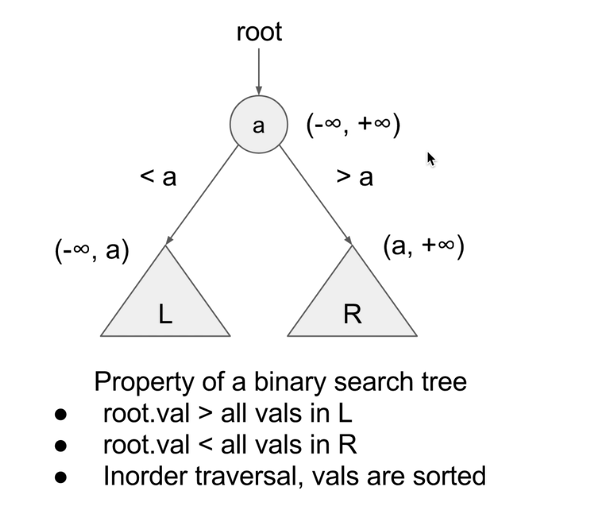

# 验证二叉搜索树 

给你一个二叉树的根节点 root ，判断其是否是一个有效的二叉搜索树。

有效 二叉搜索树定义如下：

* 节点的左子树只包含 小于 当前节点的数。
* 节点的右子树只包含 大于 当前节点的数。
* 所有左子树和右子树自身必须也是二叉搜索树。

## 思路 

### 递归(根据当前节点的范围)
> 因为不需要递归遍历整颗树, 所以递归时候需要返回值



因为二叉搜索树的元素不会重复, 所以对于某个指定节点`node`来说, 必须满足`min < node.val < max`, 所以当`node.val >= right || node.val <= left`时不是二叉搜索树. 

1. 递归需要的参数: `node: TreeNode`, 最小值`left: number`, 最大值`right: number`
2. 递归终止的条件: 
  ```typescript
  if (!node) return true
  if (node.val <= left || node.val >= right) return false 
  ```
3.单层递归需要处理的逻辑: 
  ```typescript 
  function isNodeInRange(node: TreeNode | null, left: number, right: number): boolean {

    if(!node) return true

    if(node.val <= left || node.val >= right) return false 

    return isNodeInRange(node.left, left, node.val) && isNodeInRange(node.right, node.val, right)
  }
  ```


```typescript 
export function isValidBST(root: TreeNode | null) {
  return isNodeInRange(root, -Infinity, Infinity)
}

function isNodeInRange(node: TreeNode | null, left: number, right: number): boolean {

  if(!node) return true

  if(node.val <= left || node.val >= right) return false 

  return isNodeInRange(node.left, left, node.val) && isNodeInRange(node.right, node.val, right)
}
```

### 递归(leftMax < node.val < right) 

利用二叉搜索树的特性, 即左子树的值永远小于父节点的值, 父节点的值永远小于右子树的值; 所以这里要先递归左子树 再递归右子树(中序迭代)

1. 递归需要的参数: `node: TreeNode | null`, 全局参数`max: number`记录递归当前最大值 
2. 递归终止的条件: 1) `if(!node) return true`; 2) `if(max >= node.val) return false`;
3. 单层需要处理的逻辑
  ```typescript 
  function inOrder(node: TreeNode | null): boolean {
    if(!node) return true 

    let isLeft: boolean = inOrder(node.left) 

    if(max >= node.val) return false 
    
    max = node.val

    let isRight: boolean = inOrder(node.right)

    return isLeft && isRight;
  }

  ```

```typescript
export function isValidBST(root: TreeNode | null) {
  let max: number = -Infinity; 

  function inOrder(node: TreeNode | null): boolean {
    if(!node) return true 

    let isLeft: boolean = inOrder(node.left) 

    if(max >= node.val) return false 
    
    max = node.val

    let isRight: boolean = inOrder(node.right)

    return isLeft && isRight;
  }

  return inOrder(root)
}
```

