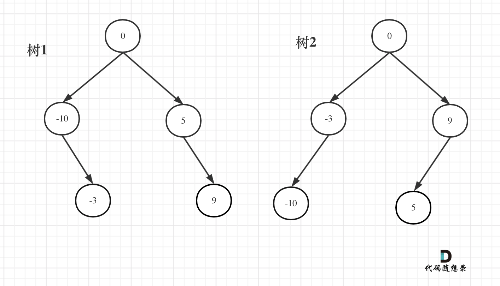

# 将有序数组转换二叉搜索树 

给你一个整数数组 `nums` ，其中元素已经按 **升序** 排列，请你将其转换为一棵**高度平衡**的*二叉搜索树*。

## 示例 

```
输入: [-10, -3, 0, 5, 9]
输出: [0, -10, 5, null, -3, null, 9]
或者输出: [0, -3, 9, -10, null, 5, null]
```


> 根据如果数组的长度为偶数时候, 取左边的值作为初始节点就是树1; 取右边的值作初始节点就是树2.  

## 思路 
这道题的难点不在于二叉树必须是平衡的, 因为只要去中间值, 就一定是平衡的. 

思路和[构建二叉树](../contruct-binary-tree/) 以及[构建最大二叉树](../max-binary-tree/) 类似, 都是通过找到中间值, 然后分割左右区间并递归来产生节点. 

### 递归

1. 确定需要的参数:`left: number, right: number`; 需要返回`root: TreeNode | null`
2. 递归终止的条件: `if(left > right) return null`
3. 单词需要处理的逻辑: 
    ```typescript
    function helper(left: number, right: number): TreeNode | null {
      if(left > right) return null

      const idx = Math.floor((right + left) / 2)

      const root = new TreeNode(nums[idx])

      root.left = helper(left, idx - 1)
      root.right = helper(idx+1, right)

      return root
    }
    ```
```typescript 
export function arrayToBST(nums: number[]) {
  function helper(left: number, right: number): TreeNode | null {
    if(left > right) return null

    const idx = Math.floor((right + left) / 2)

    const root = new TreeNode(nums[idx])

    root.left = helper(left, idx - 1)
    root.right = helper(idx+1, right)

    return root
  }

  return helper(0, nums.length - 1)
}
```

### 迭代

迭代法可以通过三个队列来模拟
* 一个队列放遍历的节点
* 一个队列放左区间下标
* 一个队列放右区间下标

```typescript 
export function preOrder(nums: number[]): TreeNode | null {
  if (!nums.length) return null

  let root = new TreeNode(0)

  const treeQueue: TreeNode[] = []
  const leftQueue: number[] = []
  const rightQueue: number[] = []

  treeQueue.push(root)
  leftQueue.push(0)
  rightQueue.push(nums.length - 1)

  while (treeQueue.length > 0) {
    let curr: TreeNode | null = treeQueue.shift()!
    let left: number = leftQueue.shift()!
    let right: number = rightQueue.shift()!

    let mid: number = Math.floor((left + right) / 2)

    curr.val = nums[mid]

    if (left < mid) {
      curr.left = new TreeNode(0)
      treeQueue.push(curr.left)
      leftQueue.push(left)
      rightQueue.push(mid - 1)
    }

    if (right > mid) {
      curr.right = new TreeNode(0)
      treeQueue.push(curr.right)
      leftQueue.push(mid + 1)
      rightQueue.push(right)
    }
  }

  return root
}

```
