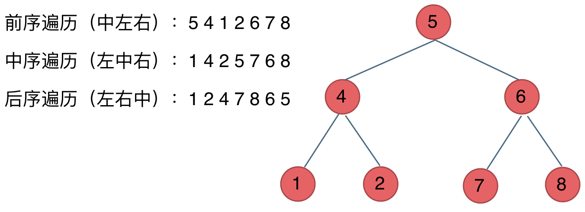

# 二叉树的递归遍历

## 递归三要素 

1. 确定递归函数的参数和返回值： 确定哪些参数是递归的过程中需要处理的，那么就在递归函数里加上这个参数， 并且还要明确每次递归的返回值是什么进而确定递归函数的返回类型。

2. 确定终止条件： 写完了递归算法, 运行的时候，经常会遇到栈溢出的错误，就是没写终止条件或者终止条件写的不对，操作系统也是用一个栈的结构来保存每一层递归的信息，如果递归没有终止，操作系统的内存栈必然就会溢出。

3. 确定单层递归的逻辑： 确定每一层递归需要处理的信息。在这里也就会重复调用自己来实现递归的过程。

### 前序遍历

以前序遍历为例, 

* 参数需要当前二叉树节点`TreeNode`和存储节点数字的数组`list`, 不需要返回值
* 终止条件为`!node?.val`
* 需要处理的逻辑: 按照当前节点, 左子节点, 右子节点的顺序一次推入栈



```typescript
import { TreeNode } from "../treenode.type"

export function preorder(node: TreeNode, nodeList: number[] ) {
  traverse(node, nodeList)
  return nodeList
}

function traverse(node:TreeNode, nodeList: number[]) {
  if(!node?.val) return 

  nodeList.push(node.val)
  traverse(node.left, nodeList)
  traverse(node.right, nodeList)
}
```

### 中序遍历

只需要改变处理的逻辑即可.

```typescript 
import { TreeNode } from "../treenode.type"

export function inorder(node: TreeNode, list: number[]): number[] {
  traverse(node, list)
  return list
}

function traverse(node: TreeNode, list: number[]) {
  if(!node?.val) return 

  traverse(node.left, list)
  list.push(node.val)
  traverse(node.right, list)
}
```

### 后序遍历

同理, 只需要改变推入节点的顺序即可.

```typescript 
import { TreeNode } from "../treenode.type"

export function postorder(node: TreeNode, list: number[]): number[] {
  traverse(node, list)
  return list
}

function traverse(node: TreeNode, list: number[]) {
  if(!node?.val) return 

  traverse(node.left, list)
  traverse(node.right, list)
  list.push(node.val)
}
```


