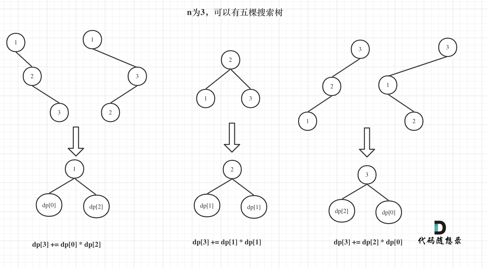

# 96. 不同的二叉搜索树

给你一个整数`n` ，求恰由 `n` 个节点组成且节点值从 1 到 n 互不相同的 **二叉搜索树** 有多少种？返回满足题意的二叉搜索树的种数。

 

## 示例

```
输入：n = 3
输出：5
```


```
示例 2：

输入：n = 1
输出：1
```

## 思路 

以 `n = 3`的情况来说,
* 当1为头节点的时候, 他的右子树有两个节点, 正好和`n = 2`时候的两棵树**布局相同**;
* 当3为头节点的时候, 他的左子树有两个节点, 也和`n = 2`时候的两棵树**布局相同**;
* 当2为头节点的时候, 它的左右子树各有一个节点, 和`n = 1`的时候布局相同 

如此以来, 我们就发现了dp[3]可以用dp[2]与dp[1]来表示
```
dp[3]，就是 元素1为头结点搜索树的数量 + 元素2为头结点搜索树的数量 + 元素3为头结点搜索树的数量

- 元素1为头结点搜索树的数量 = 右子树有2个元素的搜索树数量 * 左子树有0个元素的搜索树数量

- 元素2为头结点搜索树的数量 = 右子树有1个元素的搜索树数量 * 左子树有1个元素的搜索树数量

- 元素3为头结点搜索树的数量 = 右子树有0个元素的搜索树数量 * 左子树有2个元素的搜索树数量

dp[1] 表示有一个元素的二叉搜索树
dp[2] 表示有两个元素的二叉搜索树
dp[3] 表示有三个元素的二叉搜索树

所以dp[3] = dp[2] * dp[0] + dp[1] * dp[1] + dp[0] * dp[2]


```


### DP

1. `dp[i]` 中的 `i` 表示当 `n = i` 时候共有几颗二叉搜索树.
2. **在上面的分析中，其实已经看出其递推关系， dp[i] += dp[以j为头结点左子树节点数量] * dp[以j为头结点右子树节点数量]**, 所以递推公式为 `dp[i] += dp[j - 1] * dp[i - j]`, 其中dp[j-1]表示j为头节点的左子树数量, dp[i - j] 表示以j为头节点的右子树数量 
3. 初始化: `dp[0] = 1`
4. `dp[i]` 为当 `n = i` 时候, 头节点为j的各种之和, 所以需要双层嵌套循环
5. 如上例子 


```typescript 
export function numTrees(n: number): number {
  const dp: number[] = new Array(n + 1).fill(0);

  dp[0] = 1; 
  dp[1] = 1;

  for(let i = 2; i <= n; i++) {
    for(let j = 1; j <= i; j++) {
      dp[i] += dp[j - 1] * dp[i - j]
    }
  }

  return dp[n];
}
```
