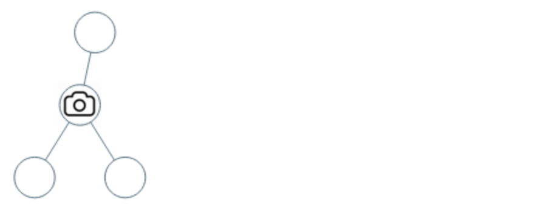
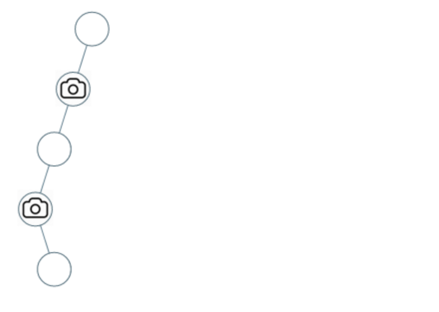

# 968. 监控二叉树 

给定一个二叉树，我们在树的节点上安装摄像头。

节点上的每个摄影头都可以监视其父对象、自身及其直接子对象。

计算监控树的所有节点所需的最小摄像头数量。

## 示例 


```
输入：[0,0,null,0,0]
输出：1
```


```
输入：[0,0,null,0,null,0,null,null,0]
输出：2
```

## 思路 

### 贪心
注意到叶子节点的父节点是需要放置摄像头的. 所以我们需要首先在叶子节点的父节点上放置摄像头, 然后由低到高进行遍历, 每两层放一个摄像头.

> 由低到高 -> 遍历顺序: 后序遍历 

> 每隔两层放一个摄像头的话, 就意味着需要进行状态变换. 进行遍历. 每个节点可能存在下面几种状态: 1) 无摄像头覆盖; 2) 放置摄像头; 3) 被摄像头覆盖; 对于空节点来说它的状态只能是有摄像头覆盖


#### 递归需要处理的逻辑

1. 左右节点都有覆盖 => 该节点为无覆盖
2. 左右节点中有一个是摄像头 => 该节点为覆盖
3. 左右节点中有一个是无覆盖 => 该节点需要摄像头
4. 根节点为无覆盖 => 加装摄像头 

```typescript 
export type StateCode = 0 | 1 | 2; 

export function minCameraCover(root: TreeNode | null): number {
  // 1 => isCamera 
  // 2 => covered 
  // 0 => not covered 
  //
  let cameras: number = 0; 

  function recur(node: TreeNode | null): StateCode {
    if(node === null) return 2 

    let left = recur(node.left);
    let right = recur(node.right);


    if(left === 0 || right === 0) {
      cameras++;
      return 1;
    } else if(left === 1 || right === 1) {
      return 2;
    } else {
      return 0;
    }
  }

  if(recur(root) === 0) {
    cameras++
  }

  return cameras;
}
```
