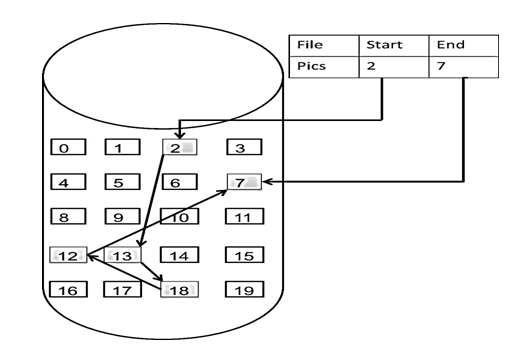

# 链表

> 链表是一种通过指针串联在一起的线性结构，每一个节点由两部分组成，一个是数据域一个是指针域（存放指向下一个节点的指针），最后一个节点的指针域指向null（空指针的意思）。链接的入口节点称为链表的头结点也就是head。  


## 链表的类型

### 单链表


链表为单方向, 一头指向空指针, 一头为最新的节点.

### 双链表


* 每一个节点有两个指针域, 分别指向两个节点.
* 既可以向前查询, 也可以向后查询

### 循环链表


链表首尾相连, 可以用来解决约瑟夫环问题.

## 链表的存储

数组在内存中是连续分布的, 链表在内存中不是连续分布的. 而是散乱地分布在内存中的某地之上, 并通过指针串联在一起.



## 链表的定义

```typescript
class ListNode<T> {
  val: T;
  next: ListNode<T> | null; 
  constructor(val?: T, next?: ListNode<T> | null) {
    this.val = val
    this.next = null
  }
}
```

## 链表的操作

### 删除节点

更改链表next的指向方向即可, 最好可以手动释放下被删除的节点

### 添加节点

删除原来的next指向, 添加新的两个指向


## 常见思路:


### 虚拟头节点

* [删除链表元素](./remove-linkedlist-element/README.md)
* [设计链表](./design-linked-list/README.md)
* [逆转链表](./reverse-linkedlist/README.md)
* [两两交换节点](./swap-nodes-in-pairs/)
* [删除列表倒数第n位](./remove-nth-node/)
* [链表相交](./intersections-of-two-linkedList/)
* [环形链表](./linkedlist-cycle/)
