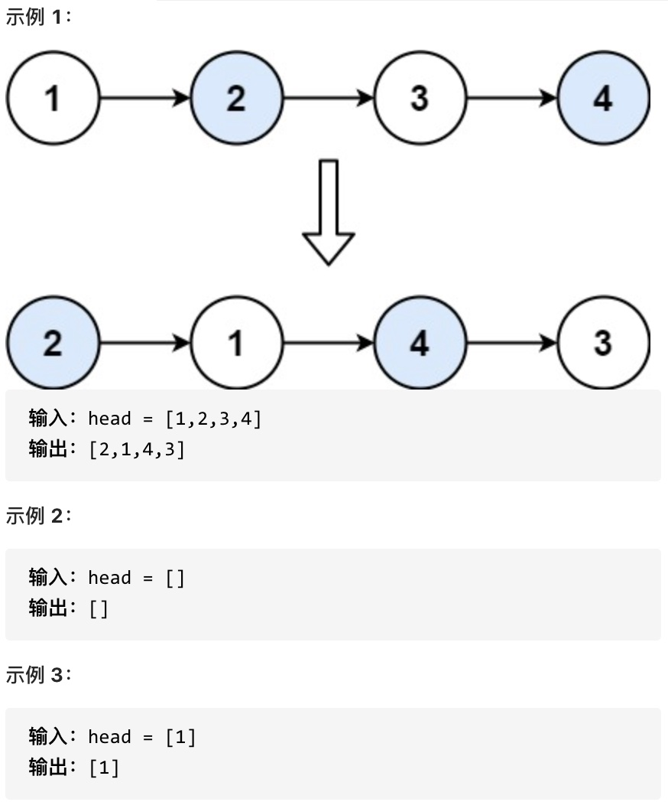

# 两两交换链表中的节点

给定一个链表，两两交换其中相邻的节点，并返回交换后的链表。

你不能只是单纯的改变节点内部的值，而是需要实际的进行节点交换。

## 示例


## 解题思路

还是通过虚拟头节点的方式进行模拟

### 四步模拟


```typescript 
import { ListNode } from '../linkedlist.types'

export function swapPairs(head: ListNode<number> |null): ListNode<number> | null {
  if(!head) return head

  let temp = new ListNode(0, head)
  let curr = temp
  
  while(curr.next && curr.next?.next) {
    let left: ListNode<number> = curr.next
    let right: ListNode<number> = curr.next.next

    left.next = right.next
    curr.next = right
    curr.next.next = left
    curr = curr.next.next
  }

  return temp.next
}
```

