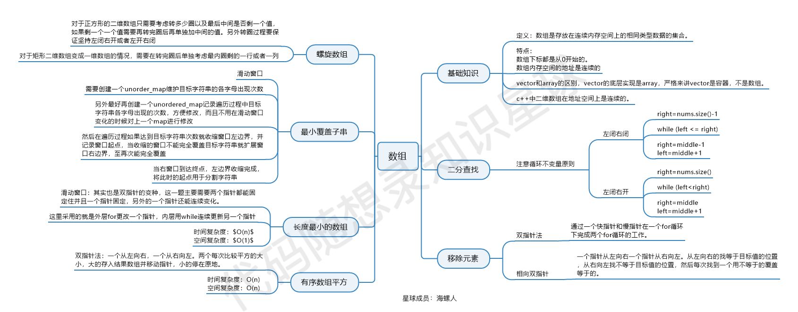

# Array

## Array Concepts 

> 数组是存放在连续空间上的相同类型数据的集合

* 数组的下标从0开始
* 数组的内存地址是连续的. 这也意味着删除一个数组中的元素, 也需要更改其他元素的位置

> 对于C来说, 二维数组的内存地址是连续的; 在Java中, 因为指针位置没有暴露, 所以二维数组的内存地址不连续

### 常见思路

* [二分法](BinarySearch/README.md): 对于有序的数组, 查找某个元素, 需要注意区间的开闭条件.
* [快慢指针](RemoveElement/README.md): 在时间复杂度上比暴力遍历提升很多,通过快慢指针提到两次遍历循环, 常用数组链表题中
* [前后快慢指针](SquareSortedArray/README.md): 注意去探究数组背后是否是有序的
* [滑动窗口](MinSizeSubarraySum/README.md): 根据当前子数组和大小的情况, 动态的调节子数组的长度(子序列的其实情况).
* [螺旋矩阵](SpiralMatrix/README.md): 注意区间的划分和边界情况下的处理.

### 总结

