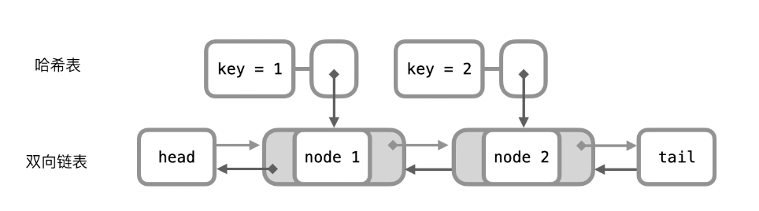
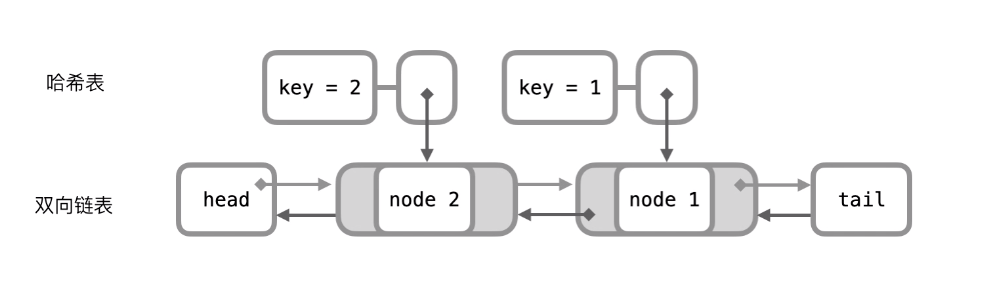
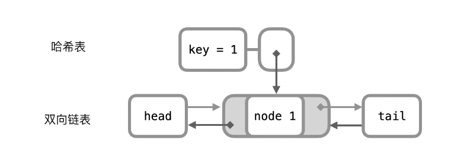
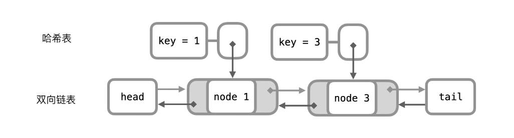

# 146. LRU Cache

Design a data structure that follows the constraints of a Least Recently Used (LRU) cache.

Implement the LRUCache class:

* LRUCache(int capacity) Initialize the LRU cache with positive size capacity.
* int get(int key) Return the value of the key if the key exists, otherwise return -1.
* void put(int key, int value) Update the value of the key if the key exists. Otherwise, add the key-value pair to the cache. 
If the number of keys exceeds the capacity from this operation, evict the least recently used key.

> The functions get and put must each run in O(1) average time complexity.


## Example

```
Input
["LRUCache", "put", "put", "get", "put", "get", "put", "get", "get", "get"]
[[2], [1, 1], [2, 2], [1], [3, 3], [2], [4, 4], [1], [3], [4]]
Output
[null, null, null, 1, null, -1, null, -1, 3, 4]

Explanation
LRUCache lRUCache = new LRUCache(2);
lRUCache.put(1, 1); // cache is {1=1}
lRUCache.put(2, 2); // cache is {1=1, 2=2}
lRUCache.get(1);    // return 1
lRUCache.put(3, 3); // LRU key was 2, evicts key 2, cache is {1=1, 3=3}
lRUCache.get(2);    // returns -1 (not found)
lRUCache.put(4, 4); // LRU key was 1, evicts key 1, cache is {4=4, 3=3}
lRUCache.get(1);    // return -1 (not found)
lRUCache.get(3);    // return 3
lRUCache.get(4);    // return 4
```

## Solutions


### HashMap + Doubly Linked List

* Because the description mentioned we need to run `O(1)` to get and put the value, we need to use a HashMap to store the key-value pair.
* We also need to keep track of the order of the keys, so we need to use a Doubly Linked List to store the keys.

here are the demostration of how the data structure works in the given example:





```ts

```
