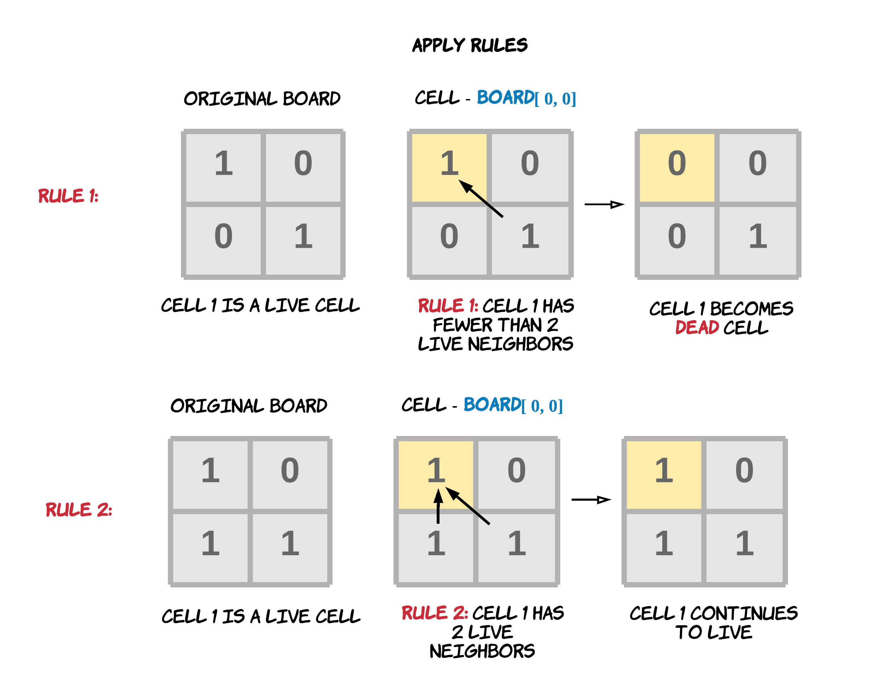
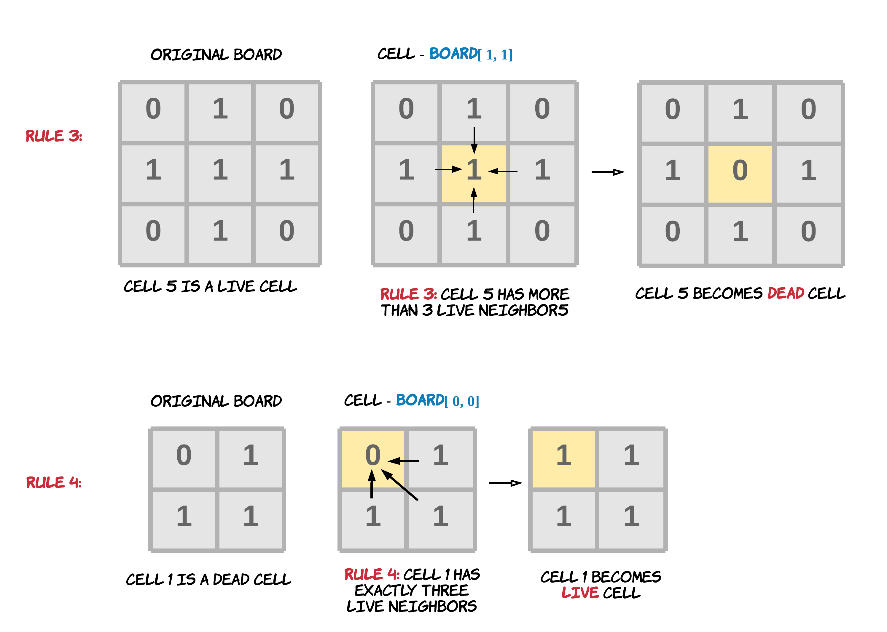

# 289. Game of Life

> According to Wikipedia's article: "The Game of Life, also known simply as Life, is a cellular automaton devised by the British mathematician John Horton Conway in 1970."

The board is made up of an m x n grid of cells, 
where each cell has an initial state: live (represented by a 1) or dead (represented by a 0). 
Each cell interacts with its eight neighbors (horizontal, vertical, diagonal) using the following four rules (taken from the above Wikipedia article):

* Any live cell with fewer than two live neighbors dies as if caused by under-population.
* Any live cell with two or three live neighbors lives on to the next generation.
* Any live cell with more than three live neighbors dies, as if by over-population.
* Any dead cell with exactly three live neighbors becomes a live cell, as if by reproduction.




The next state is created by applying the above rules simultaneously to every cell in the current state, where births and deaths occur simultaneously. 
Given the current state of the m x n grid board, return the next state.


## Example

```
Input: board = [[0,1,0],[0,0,1],[1,1,1],[0,0,0]]
Output: [[0,0,0],[1,0,1],[0,1,1],[0,1,0]]
```


```
Input: board = [[1,1],[1,0]]
Output: [[1,1],[1,1]]
```

## Solution

### simulation
> Notice, by 8 neighbors, it means 8 possible neighbors, for the ones in the corner of the board, they don't have up to 8 neighbors

There's actually a hidden restriction: the updated cells can't interfere the results of other cells, which means we can't just change the cell by one iteration, must keep a note of **each cell's update value** and **update all together**. 

```ts
export function gameOfLife(board: number[][]): void {
  const m = board.length;
  const n = board[0].length;

  const copyBoard = board.map(row => [...row]);
  const neighbors = [0, 1, -1];

  for(let row = 0; row < m; row++) {
    for(let col = 0; col < n; col++) {
      let liveNeighbor = 0;
      // go to its neighbor
      for(let i = 0; i < 3; i++) {
        for(let j = 0; j < 3; j++) {
          if(!(neighbors[i] === 0 && neighbors[j] === 0)) {
            let r = row + neighbors[i];
            let c = col + neighbors[j];
            if((r < m && r>=0) && (c<n && c>=0) && copyBoard[r][c] === 1) {
              liveNeighbor++;
            }
          }
        }
      }

      if(copyBoard[row][col] === 1 && (liveNeighbor < 2 || liveNeighbor > 3)) {
        board[row][col] = 0;
      }

      if(copyBoard[row][col] === 0 && liveNeighbor === 3) {
        board[row][col] = 1;
      }
    }
  }
}
```
> Time Complexity is `O(mn)`, Space Complexity is `O(mn)`(need to copy the whole board)

### optimized approach -> Bit

We could essentially assign each cell with a bit structure like `next | curr`, 
* if after the rules checkout, it will be 1, we assign them as `1 | curr`. in ts, simply add by 2
* when checking other cells' value, check if the reminder of the value divided by 2 is 1


```ts
export function gameOfLifeOptimal(board: number[][]): void {
  const m = board.length;
  const n = board[0].length;

  for(let row = 0; row < m; row++) {
    for(let col = 0; col < n; col++) {

      let alive = calculateAlive(row, m, col, n, board);

      if(board[row][col] === 1) {
        if(alive == 2 || alive === 3) {
          board[row][col] += 2;
        }
      } else if(board[row][col] === 0) {
        if(alive === 3) {
          board[row][col] += 2;
        }
      }
    }
  }

  for(let i = 0; i < m; i++) {
    for(let j = 0; j < n; j++) {
      board[i][j] >>= 1;
    }
  }
}

export function calculateAlive(row: number, m: number, col: number, n: number, board: number[][]) {
  let alive = 0;

  for (let i = Math.max(0, row - 1); i <= Math.min(m - 1, row + 1); i++) {
    for (let j = Math.max(0, col - 1); j <= Math.min(n - 1, col + 1); j++) {
      if (row === i && col === j) continue;

      if (board[i][j] % 2 === 1) alive++;
    }
  }

  return alive;
}
```

