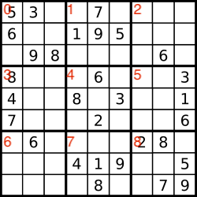

# 36. Valid Sudoku

Determine if a 9 x 9 Sudoku board is valid. Only the filled cells need to be validated according to the following rules:

1. Each row must contain the digits 1-9 without repetition.
2. Each column must contain the digits 1-9 without repetition.
3. Each of the nine 3 x 3 sub-boxes of the grid must contain the digits 1-9 without repetition.

Note:

* A Sudoku board (partially filled) could be valid but is not necessarily solvable.
* Only the filled cells need to be validated according to the mentioned rules.


## Example
```
Input: board =
[["5","3",".",".","7",".",".",".","."]
,["6",".",".","1","9","5",".",".","."]
,[".","9","8",".",".",".",".","6","."]
,["8",".",".",".","6",".",".",".","3"]
,["4",".",".","8",".","3",".",".","1"]
,["7",".",".",".","2",".",".",".","6"]
,[".","6",".",".",".",".","2","8","."]
,[".",".",".","4","1","9",".",".","5"]
,[".",".",".",".","8",".",".","7","9"]]
Output: true
```

```
Input: board =
[["8","3",".",".","7",".",".",".","."]
,["6",".",".","1","9","5",".",".","."]
,[".","9","8",".",".",".",".","6","."]
,["8",".",".",".","6",".",".",".","3"]
,["4",".",".","8",".","3",".",".","1"]
,["7",".",".",".","2",".",".",".","6"]
,[".","6",".",".",".",".","2","8","."]
,[".",".",".","4","1","9",".",".","5"]
,[".",".",".",".","8",".",".","7","9"]]
Output: false
Explanation: Same as Example 1, except with the 5 in the top left corner being modified to 8. Since there are two 8's in the top left 3x3 sub-box, it is invalid.
```

## Solution

### A template for TraceBack
```
function backTracing(args):void {
   if(endCondition) {
     /* store the result */
     return;
   } 
   
   for(loopCondition) {
     /* dealing with nodes, do something here */
     backTracing(args);
     /* revert last operation */
   }
}
```
### Simulation
suppose we are iterating rows using index `i`, iterating col using index `j`:
* as for checking box rule: we need to understand this
  * 
  * given `i` and `j`, the box where the element is in should be `(i / 3) * 3 + (j / 3)` (in the case where `1 / 3 = 0`), in JS, it should be `Math.trunc(i / 3) * 3 + Math.trunc(j / 3)`


```ts
export function isValidSudokuSimulation(board: string[][]): boolean {
  const boardSize = board.length;
  const boxSize = boardSize / 3;
  const EMPTY = ".";

  const rowMap:Map<number, Set<number>> = new Map();
  const colMap:Map<number, Set<number>> = new Map();
  const boxMap:Map<number, Set<number>> = new Map();

  for(let i = 0; i < 9; i++) {
    rowMap.set(i, new Set());
    colMap.set(i, new Set());
    boxMap.set(i, new Set());
  }

  for(let i = 0; i < boardSize; i++) {
    for(let j = 0; j < boardSize; j++) {
      if(board[i][j] === EMPTY) continue;

      const num = Number(board[i][j]);

      const box_idx = Math.floor(i / 3) * boxSize + Math.floor(j / 3);

      if(rowMap.get(i)?.has(num) || colMap.get(j)?.has(num) || boxMap.get(box_idx)?.has(num)) return false;

      rowMap.get(i)?.add(num);
      colMap.get(j)?.add(num);
      boxMap.get(box_idx)?.add(num);
    }
  }

  return true;
}
```


### optimized solution
* we can use set to help us check if the current element is duplicated or not
* Use one iteration to check for 3 rules, say, I am checking `row_0` by doing `board[0][j]`, so I can also check `col_0` by doing `board[i][0]` 
Hence in this case I should also be checking `box_0`
  * (i / 3) * 3 + (j / 3) should be its row index 
  * (i % 3) * 3 + (j % 3) should be its col index
  
```ts
export function isValidSudoku(board: string[][]): boolean {
  const boardSize = board.length;
  const boxSize = boardSize / 3;
  const EMPTY = ".";

  const rowSet = new Set();
  const colSet = new Set();
  const boxSet = new Set();

  // one iteration check 3 rules
  for(let i = 0; i < boardSize; i++) {
    rowSet.clear();
    colSet.clear();
    boxSet.clear();

    for(let j = 0; j < boardSize; j++) {
      const rowEle = board[i][j];
      const colEle = board[j][i];

      if(rowEle !== EMPTY) {
        if(rowSet.has(rowEle)) return false;
        rowSet.add(rowEle);
      }

      if(colEle !== EMPTY) {
        if(colSet.has(colEle)) return false;
        colSet.add(colEle);
      }

      let x = Math.trunc(i / 3) * boxSize + Math.trunc(j / 3);
      let y = (i % 3) * boxSize + j % 3;
      const boxEle = board[x][y];
      if(boxEle !== EMPTY) {
        if(boxSet.has(boxEle)) return false;  
        boxSet.set(boxEle);    
      }   
    }
  }

  return true;
}
```

