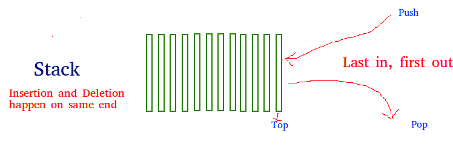

# 栈与队列

## 栈

> Stack is a linear data structure which follows a particular order in which the operations are performed. The order may be **LIFO**(Last In First Out) or **FILO**(First In Last Out).



Stack typically have the following functionalities: 
* `push`: add data element into the end of the stack  
* `pop`: remove the element at the top of the stack 
* `peek`: look at the top element of the stack 
* `size`: hold the number of the elements in the stack. Could be refer as `Count` or `Length` as well. 

```typescript
export class StackElement<T> {
  // hold the data of a single stack element
  private _value: T;
  get value(): T {
    return this._value
  }
  set value(val: T) {
    this._value = val
  }

  // refernec to the next stack element 
  private _next: StackElement<T>
  get next(): StackElement<T> {
    return this._next
  }
  set next(val: StackElement<T>){
    this._next = val
  }

  constructor(val: T) {
    this._value = val
    this._next = null
  }
}

export class Stack<T> {
  private _first: StackElement<T>
  get first() {
    return this._first
  }
  set first(val: StackElement<T>) {
    this._first = val
  }

  private _last: StackElement<T> 
  get last() {
    return this._last;
  }
  set last(val: StackElement<T>) {
    this._last = val
  }
  
  private _size: number;
  get size() {
    return this._size;
  }
  set size(n: number) {
    this._size = n
  }

  constructor() {
    this._first = null
    this._last = null
    this._size = 0 
  } 

  push(val: T) {
    let newElement = new StackElement<T>(val)

    if(this._size === 0) {
      this._first = newElement
      this._last = newElement
    } else {
      this._last.next = newElement
      this._last = newElement
    }

    this._size++
    return true
  }

  pop(): T | null {
    if(this._size === 0) return null

    let prev = this._first

    this._first = prev.next
    this._size --

    return prev.value
  }

  peek(): T | null {
    if(this._size === 0) return null 
    return this._first.value
  }
}
```


## 队列

> A Queue is a linear structure which follows a particular order in which the operations are performed. The order is **First In First Out** (FIFO). A good example of a queue is any queue of consumers for a resource where the consumer that came first is served first. 


> The difference between stacks and queues is in removing. In a stack we remove the item the most recently added; in a queue, we remove the item the least recently added.


### 用链表构造队列
```typescript
export class Node<T> {
  private _val: T | null 
  private _next: Node<T> | null

  constructor(val: T) {
    this._val = val
    this._next =  null
  }

  set value(val) {
    this._val = val
  }

  get value(): T | null{
    return this._val
  }

  set next(node: Node<T>) {
    this._next = node
  }

  get next(): Node<T> | null {
    return this._next
  }
}


export class Queue<T> {
  private head: Node<T> | null
  private tail: Node<T> | null

  constructor() {
    this.head = null
    this.tail = null
  }

  push(val: T) {
    let node = new Node(val)

    if(!this.head) {
      this.head = node
      this.tail = node 
    } else {
      this.tail.next = node
      this.tail = node 
    }
  }

  pop(): T | null {
    if(!this.head) return null

    let prev = this.head
    let next = this.head.next 

    this.head = next
    if(!next) this.tail = null

    return prev.value
  }

  peek(): T | null {
    if(!this.head) return null

    return this.head.value
  }
}
```

### 用栈构造队列
[用栈实现队列](./implement-queue/README.md)
