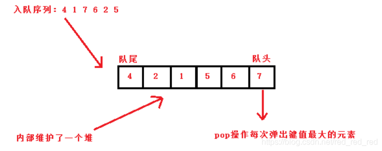

# 前K高频元素

给你一个整数数组`nums`和一个整数`k` ，请你返回其中出现频率前 `k` 高的元素。你可以按 任意顺序 返回答案。

## 示例

```
输入: nums = [1,1,1,2,2,3], k = 2
输出: [1,2]
```

```
输入: nums = [1], k = 1
输出: [1]
```

## 思路

### 优先级队列 + 小顶堆

> 大家经常说的大顶堆（堆头是最大元素），小顶堆（堆头是最小元素），如果懒得自己实现的话，就直接用priority_queue（优先级队列）就可以了，底层实现都是一样的，从小到大排就是小顶堆，从大到小排就是大顶堆。


> 优先级队列(Priority Queue)是一个带有权值的队列, 虽它和队列一样只允许在队列底端加入元素, 从队列顶端取除元素, 但是内部的排列顺序是带有权重的, 权值最高者排在最前面. **默认情况下是大堆, 权值最大的排在最前面** 



这个解法就是维护一个小顶堆的优先级队列, 每次加入新元素的时候, 都把最小的元素弹出队列, 最后小顶堆里剩下的就是前K个最大元素. 

```typescript
export class PriorityQueue {
  queue: number[][] 

  constructor() {
    this.queue = []
  }

  push(val: number[] ) {
    this.queue.push(val)
    // 创建小栈堆
    this.prioritize()
  }

  pop(){
    this.queue.shift()
  }

  size() {
    return this.queue.length
  }

  // 把频率最小的把元素放在最前面
  // 频率小 === 权重高 
  prioritize() {
    let tmp: number[]
    for(let i = this.size() - 1; i > 0; i--) {
      if(this.queue[i][1] < this.queue[i-1][1]) {
        tmp = this.queue[i - 1]
        this.queue[i - 1] = this.queue[i]
        this.queue[i] = tmp
      }
    }
  }
}
```

```typescript
export function topKFrequency(nums: number[], k: number): number[] {
  const pQueue: PriorityQueue = new PriorityQueue()
  const freqMap: Map<number, number> = new Map()

  for(let n of nums) {
    freqMap.set(n, (freqMap.get(n) || 0) + 1)
  }

  for(const entry of freqMap.entries()) {
    pQueue.push(entry)
    if(pQueue.size() > k) { 
      pQueue.pop()
    }
  }
  
  return pQueue.queue.map(entry => entry[0])
}
```

以上代码可以精简为

```typescript
export function topKFrequencyII(nums: number[], k: number): number[] {
  const freqMap: Map<number, number> = new Map() 

  for(let i of nums) {
    freqMap.set(i, (freqMap.get(i) || 0) + 1 )
  }

  return [...freqMap.entries()]
    .sort((a, b) => b[1] - a[1])
    .slice(0, k)
    .map(i => i[0])
}
```


