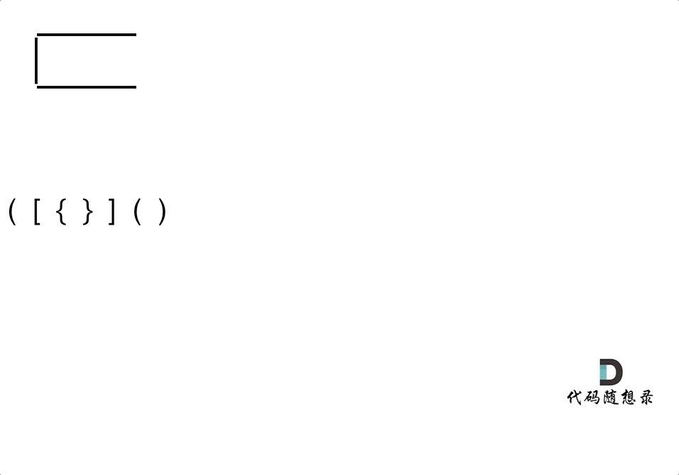

# 有效的括号

给定一个只包括 `'('`，`')'`，`'{'`，`'}'`，`'['`，`']'` 的字符串 `s` ，判断字符串是否有效。

有效字符串需满足：

左括号必须用相同类型的右括号闭合。
左括号必须以正确的顺序闭合。

## 思路

符号不匹配的情况有3种
* 左方向的括号多余了
* 括号的类型不匹配
* 右方向的括号多余了

所以只需要判断这三种情况是否会出现即可



```typescript 
export function isValid(s: string): boolean {
  let pairMap: Map<string, string> = new Map() 
  pairMap.set(")", "(")
  pairMap.set("]", "[")
  pairMap.set("}", "{")


  let targetArr: string[] = []

  for(let char of s) {
    let leftFound = pairMap.get(char)

    if(!leftFound) {
      targetArr.push(char)
    } else {
      let lastChar = targetArr.pop()
      if(lastChar !== leftFound) {
        return false 
      }
    }
  }

  return targetArr.length === 0 
}
```

